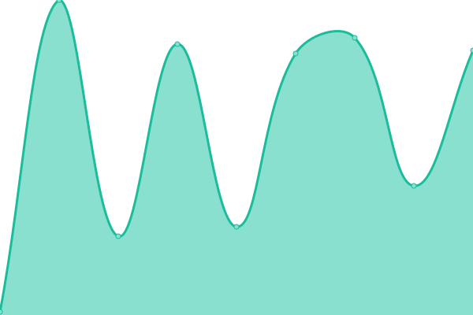
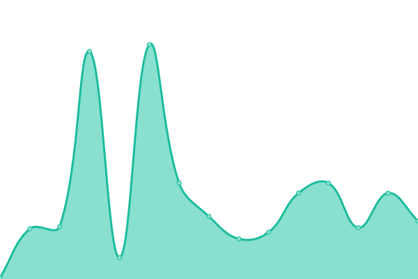
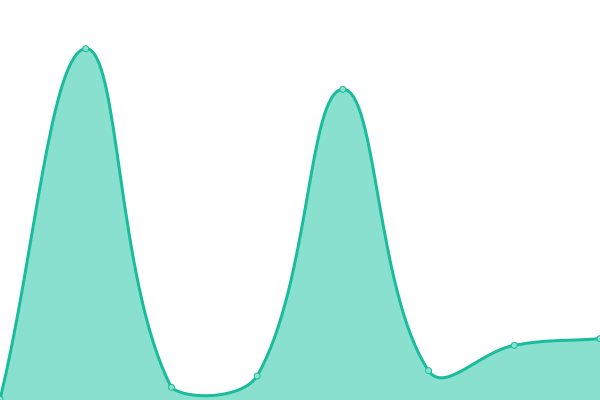

# [📈 Live Status](https://status.serverarmour.com): <!--live status--> **🟧 Partial outage**

This repository contains the open-source uptime monitor and status page for [Upptime](https://upptime.js.org), powered by [Upptime](https://github.com/upptime/upptime).

With [Upptime](https://upptime.js.org), you can get your own unlimited and free uptime monitor and status page, powered entirely by a GitHub repository. We use [Issues](https://github.com/upptime/upptime/issues) as incident reports, [Actions](https://github.com/Pho3niX90/uptime/actions) as uptime monitors, and [Pages](https://status.serverarmour.com) for the status page.

<!--start: status pages-->
<!-- This summary is generated by Upptime (https://github.com/upptime/upptime) -->
<!-- Do not edit this manually, your changes will be overwritten -->
<!-- prettier-ignore -->
| URL | Status | History | Response Time | Uptime |
| --- | ------ | ------- | ------------- | ------ |
|  [Website](https://io.serverarmour.com) | 🟩 Up | [website.yml](https://github.com/Pho3niX90/uptime/commits/HEAD/history/website.yml) | 

 2267ms
     
 | 

<a href="https://status.serverarmour.com/history/website">99.22%</a>
    

|  [API](https://io.serverarmour.com/api/v1/ping) | 🟩 Up | [api.yml](https://github.com/Pho3niX90/uptime/commits/HEAD/history/api.yml) | 

 146ms
     
 | 

<a href="https://status.serverarmour.com/history/api">98.64%</a>
    

|  [DB](https://io.serverarmour.com/api/v1/ping/db) | 🟥 Down | [db.yml](https://github.com/Pho3niX90/uptime/commits/HEAD/history/db.yml) | 

 2405ms
     
 | 

<a href="https://status.serverarmour.com/history/db">94.31%</a>
    

|  [REDIS](https://io.serverarmour.com/api/v1/ping/redis) | 🟨 Degraded | [redis.yml](https://github.com/Pho3niX90/uptime/commits/HEAD/history/redis.yml) | 

 3360ms
     
 | 

<a href="https://status.serverarmour.com/history/redis">94.08%</a>
    

|  [Discord Notifications](https://io.serverarmour.com/api/v1/ping/notifications) | 🟩 Up | [discord-notifications.yml](https://github.com/Pho3niX90/uptime/commits/HEAD/history/discord-notifications.yml) | 

 478ms
     
 | 

<a href="https://status.serverarmour.com/history/discord-notifications">96.59%</a>
    

<!--end: status pages-->

[**Visit our status website →**](https://status.serverarmour.com)

## 📄 License

- Powered by: [Upptime](https://github.com/upptime/upptime)
- Code: [MIT](./LICENSE) © [Upptime](https://upptime.js.org)
- Data in the `./history` directory: [Open Database License](https://opendatacommons.org/licenses/odbl/1-0/)
